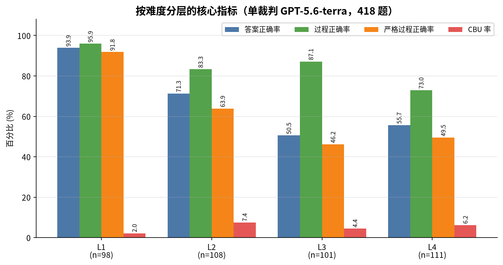
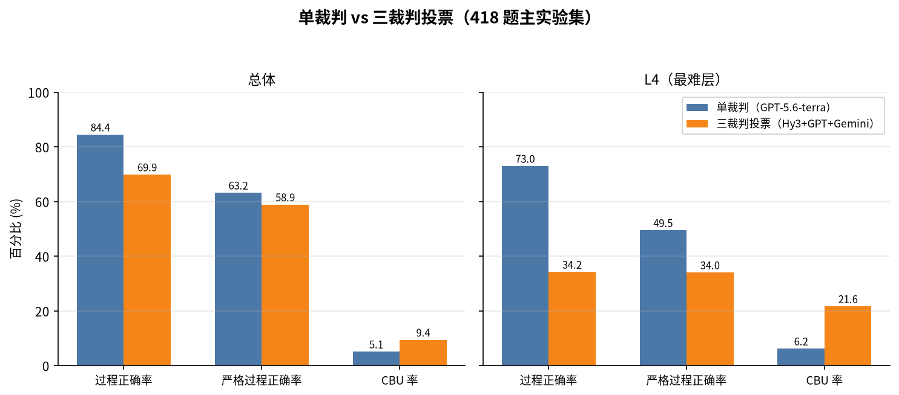
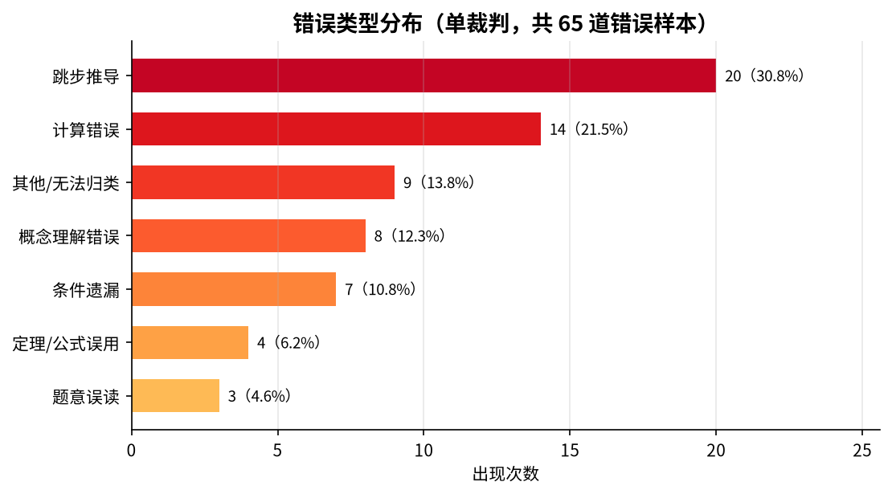
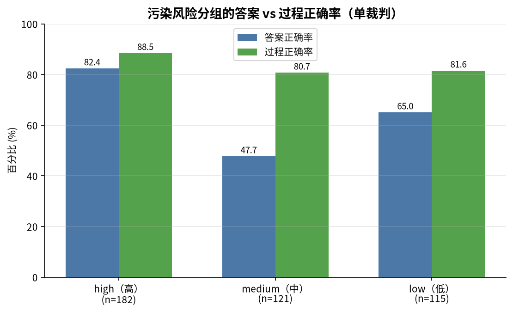
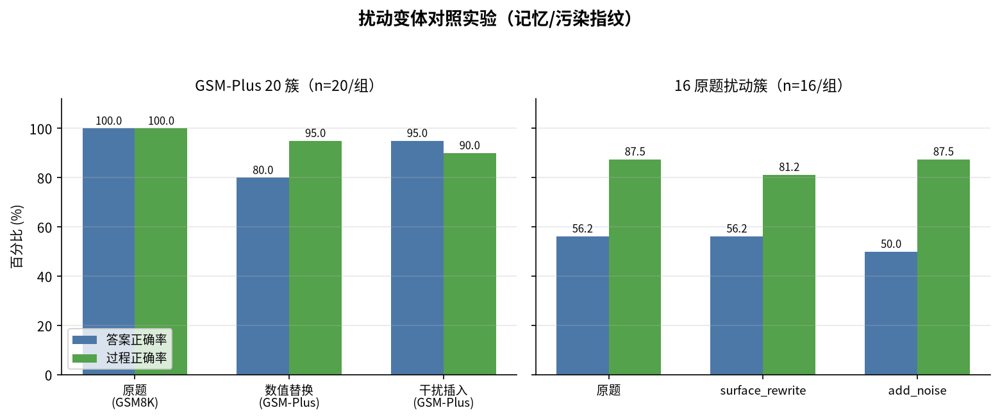
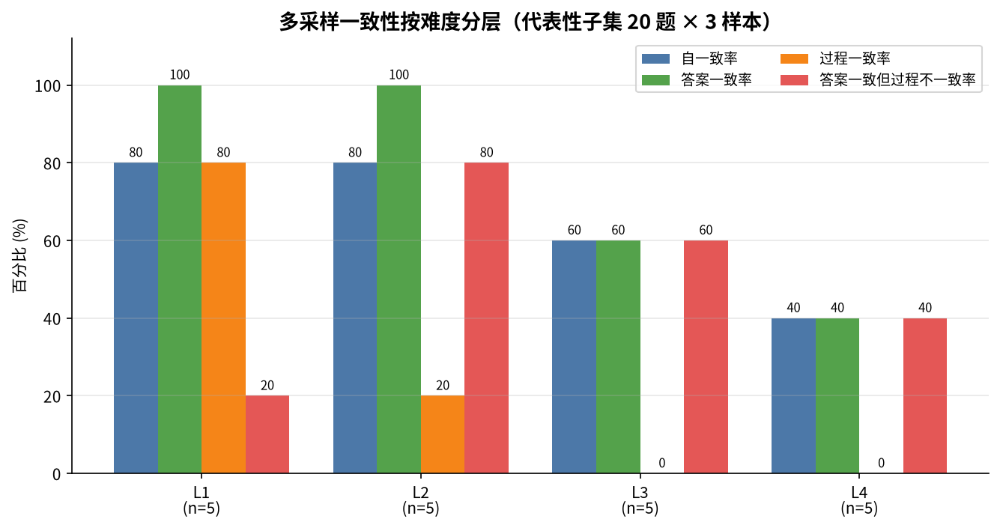
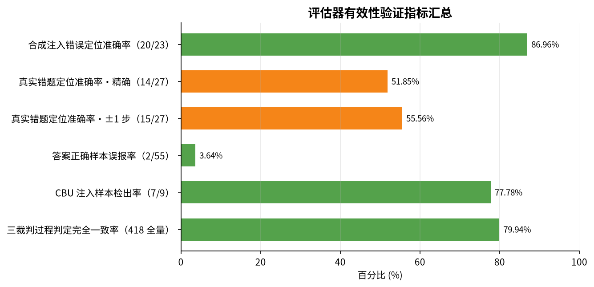
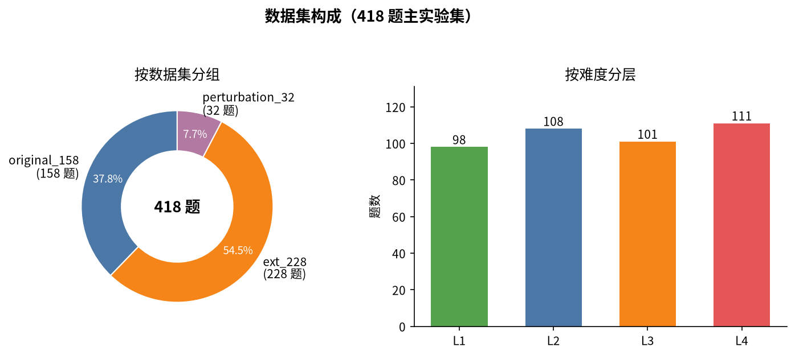
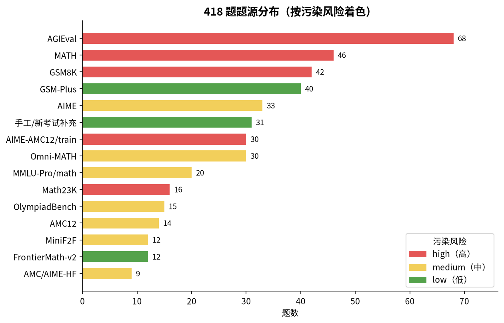
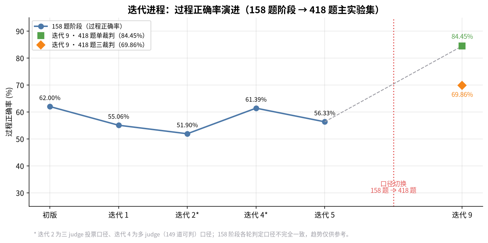

<div align="center">

# 🕵️ Hy3 Math Forensics

### 基于腾讯混元 Hy3 的数学可验证推理与过程评估系统

**不止判答案对错，更要审计推理过程** —— 逐层审查推导链条 · 定位首错步骤 · 归因错误类型 · 识别"蒙对"样本

[](requirements.txt)
[](https://github.com/vllm-project/vllm)
[](https://github.com/Tencent-Hunyuan)
[](https://huggingface.co/datasets/yerr2/hy3-math-forensics-dataset)
[](evaluator/multi_judge.py)

[🎯 项目背景](#-项目背景) · [🚀 快速开始](#-快速开始) · [📊 评测结果](#-最终评测结果完整主实验集-418-题) · [🔬 评估方法](#-过程评估方法) · [✅ 有效性验证](#-评估器有效性验证修复后) · [📚 数据集](#-数据集)

> 📢 本项目为「犀牛鸟开源实战任务 · 任务二」个人/活动作品，非腾讯官方发布。
> 📄 完整项目报告见 [`PROJECT_REPORT.md`](PROJECT_REPORT.md) ｜ 📊 深度分析报告见 [`ANALYSIS_REPORT.md`](ANALYSIS_REPORT.md) ｜ 💡 踩坑记录与经验总结见 [`PROJECT_LESSONS.md`](PROJECT_LESSONS.md) ｜ 📦 交付清单见 [`DELIVERABLES.md`](DELIVERABLES.md)

</div>

---

## 🎯 项目背景

大型语言模型在数学推理任务上往往只输出最终答案，难以判断其推理过程是否严谨。**答案对了，过程就一定对吗？** 本项目针对这一问题，设计并实现了一套多层混合的过程评估方案：

| 能力 | 说明 |
|---|---|
| 📏 **规则校验** | 检查步骤结构、重复、循环复制等 |
| ∑ **符号执行** | 使用 `sympy` 自动验证数学等式与数值计算 |
| ⚖️ **LLM-as-judge** | 调用外部强模型对每步推导进行语义审查；L4/Research 题启用更严格 prompt |
| 🗳️ **多 Judge 交叉复核** | 支持配置多个 OpenAI 兼容端点进行投票，降低单一裁判波动 |
| ✂️ **截断/未完成检测** | 基于 `finish_reason`、输出末尾、最终答案标记与长度，识别输出被截断的解答 |
| 🎲 **结果-过程一致性检测** | 识别猜中答案、数值巧合、定理误用却结果正确等情况（CBU） |

---

## 🗂 目录结构

<details>
<summary>完整目录结构</summary>


<details>
<summary><b>完整目录树</b></summary>

```text
hy3-math-eval/
├── README.md                        # 本文件
├── PROJECT_REPORT.md                # 完整项目报告（方法、设计、数据、评估、结果）
├── PROJECT_LESSONS.md               # 踩坑记录、解决思路与项目经验
├── DELIVERABLES.md                  # 交付物清单
├── .env.example                     # API/本地模型配置样例
├── requirements.txt                 # Python 依赖
├── app/                             # 应用侧：推理、提示词、解析
│   ├── hy3_client.py                # vLLM / OpenAI 兼容 API 封装
│   ├── prompt_templates.py          # 解题提示词（含 depends_on 要求）
│   ├── solution_parser.py           # 解题过程结构化解析
│   ├── generate_solutions.py        # 批量生成入口
│   ├── multi_sample_generator.py    # 多采样一致性生成
│   ├── web_app.py                   # FastAPI 可视化 Web 应用后端
│   └── static/                      # Web 应用前端（单页应用）
│       └── index.html
├── dataset/                         # 题库与校验
│   ├── build_dataset.py             # 构造 legacy 题库
│   ├── convert_math_data.py         # 转换外部公开数据集
│   ├── convert_frontiermath.py      # FrontierMath v2 样本转换
│   ├── answer_checker.py            # 标准答案自动校验
│   ├── problems_merged_full_stats.md # 418 题多维分类统计
│   └── *.jsonl                      # 题目数据文件托管于 Hugging Face（见 📚 数据集章），
│                                    # 含 418 题主实验集 / 158 题子集 / 扰动变体 / 注入验证集等
├── evaluator/                       # 过程评估模块
│   ├── process_evaluator.py         # 评估主入口
│   ├── step_validator.py            # 单步规则+符号验证
│   ├── llm_judge.py                 # LLM-as-judge（含 Research 严格 prompt）
│   ├── multi_judge.py               # 多 judge 交叉投票
│   ├── truncation_checker.py        # 输出截断/未完成检测
│   ├── error_classifier.py          # 错误类型归类
│   ├── correct_but_wrong_process.py # 结果正确但过程不成立检测
│   ├── dependency_graph.py          # 依赖图显式验证
│   ├── back_substitution.py         # 回代验证器
│   ├── consistency_analyzer.py      # 多采样一致性分析
│   ├── memory_detection_metrics.py  # 记忆 / 模板探测指标
│   ├── reverse_verifier.py          # Math-Shepherd 反向验证器（步骤级奖励评分）
│   ├── evaluate.py                  # 批量评估
│   └── validate_evaluator.py        # 评估器有效性验证
├── scripts/                         # 运行脚本
│   ├── run_full_pipeline.sh         # 146 题主库一键评测
│   ├── run_merged_pipeline.sh       # 158 题合并题集一键评测
│   ├── generate_report.py           # 生成评测报告
│   ├── generate_final_report.py     # 生成最终综合分析报告
│   ├── rebuild_evaluation.py        # 用新 checker 重建评估结果
│   ├── expand_dataset_v2.py         # 从 new_expand 生成 386 题扩展集
│   ├── merge_full_dataset.py        # 合并 386 + 32 扰动变体为 418 题并打多维标签
│   ├── run_consistency_analysis.py  # 多采样一致性分析
│   ├── compute_judge_agreement.py   # 多 judge 一致率与 Cohen's κ
│   ├── single_judge_stability.py    # 单 judge 重复稳定性测试
│   ├── gpt_manual_audit.py          # 按人工标注规范执行人工复核
│   ├── download_model_from_modelscope.py  # ModelScope 下载
│   ├── run_web_app.sh               # 启动 FastAPI 可视化 Web 应用
│   ├── hy3_proxy.py                 # 为 React 工作台提供 CORS 代理
│   ├── validate_real_errors.py      # 真实答错题定位准确率验证
│   ├── validate_false_positives.py  # 正确样本误报率验证
│   ├── validate_cbu_injection.py    # CBU 注入样本检出率验证
│   └── run_reverse_verification.py  # 反向验证器批量运行
├── frontend/                        # React + Vite 可视化工作台（浏览器端直连 Hy3 API）
│   ├── package.json
│   ├── src/
│   │   ├── App.tsx
│   │   ├── sections/                # Workbench / Dashboard / Cases / Dataset
│   │   └── lib/hy3.ts               # 浏览器端 Hy3 客户端与过程评估 prompt
│   └── index.html
├── demo/                            # 单次解题 demo
│   └── demo.py
├── validation/                      # 有效性验证与人工抽检
│   ├── validation_summary.md
│   └── frontiermath_spot_check.md
├── audit_outputs/                   # 人工复核审计记录
│   ├── l2_gold_verify.jsonl
│   ├── spot_correct_audit.jsonl
│   ├── wrong_answer_fixed_audit.jsonl
│   └── cbu_injection_audit.jsonl
└── results/                         # 输出结果
    ├── solutions_v2.jsonl
    ├── frontiermath_solutions.jsonl
    ├── solutions_merged.jsonl
    ├── solutions_merged_depgraph_6k.jsonl
    ├── evaluation_merged_depgraph_6k_gpt.json
    ├── evaluation_results_merged_gpt_judge.json
    ├── evaluation_results_merged_multi_judge_fixed.json
    ├── metrics_report_merged_gpt_judge.md
    ├── metrics_report_merged_multi_judge_final.md
    ├── final_report_gpt_judge.md
    ├── final_report_multi_judge_final.md
    ├── consistency_analysis_subset.json
    ├── consistency_analysis_subset_report.md
    ├── consistency_analysis_l2_all.json
    ├── consistency_analysis_l2_all_report.md
    ├── l2_memory_metrics.json
    ├── l2_memory_metrics_report.md
    ├── l2_case_analysis.md
    ├── l2_consistency_summary.json
    ├── dataset_expansion_report.md
    ├── judge_agreement_stats.json
    ├── single_judge_stability.json
    ├── evaluation_cbu_injection.json
    ├── evaluation_results_perturbed.json
    ├── perturbation_analysis.md
    └── validation_results_v2.json
```

</details>


</details>

---

## ⚙️ 环境配置

<details>
<summary>环境安装与 API 配置</summary>


### 1️⃣ 基础环境

需要 Python 3.10+，并安装 PyTorch（>=2.1，需匹配你的 CUDA 版本）、vLLM、transformers 等基础依赖。建议使用独立的虚拟环境：

```bash
# 方式一：venv
python3 -m venv .venv
source .venv/bin/activate

# 方式二：conda
conda create -n hy3-math-eval python=3.10
conda activate hy3-math-eval
```

激活虚拟环境后使用 `python3`/`pip` 执行后续命令。

### 2️⃣ 安装额外依赖

```bash
cd hy3-math-eval
pip install -r requirements.txt
```

### 3️⃣ 模型准备

支持两种模型接入方式，**任选其一**即可：

**方式 A：官方 API Token（推荐，无需 GPU / 本地部署）**

通过腾讯混元官方 OpenAI 兼容 API 直接调用 Hy3。在项目根目录创建 `.env` 文件：

```bash
# 官方 API 网关（以官方文档为准）
HY3_API_BASE=https://api.hunyuan.cloud.tencent.com/v1
HY3_MODEL_NAME=hy3
HY3_API_KEY=your_official_api_token   # 在官方控制台申请的 API Token
```

**方式 B：自部署 vLLM 服务**

如果你已自行部署 Hy3（如本地 vLLM 服务），指向你的服务端点即可：

```bash
HY3_API_BASE=http://0.0.0.0:8002/v1
HY3_MODEL_NAME=hy3-gptq-int4
HY3_API_KEY=dummy
```

`app/hy3_client.py` 启动时会自动加载 `.env` 中的变量。两种方式都是 OpenAI 兼容协议，上层代码无需任何改动；若完全未设置 `HY3_API_BASE`，则回退到本地 vLLM 加载（需充足显存）。详见 `.env.example`。

### 4️⃣ LLM-as-judge 裁判配置

为防止 **Hy3 自评（自己给自己打分）** 导致分数虚高，单 judge 模式已默认优先使用外部 GPT 裁判。请在 `.env` 中配置：

```bash
# 单 judge 默认裁判（强烈推荐使用外部模型；填你的 OpenAI 兼容 API 网关地址）
JUDGE_GPT_API_BASE=https://your-openai-compatible-endpoint/v1
JUDGE_GPT_API_KEY=your_key
JUDGE_GPT_MODEL=gpt-5.6-terra
```

若未配置 `JUDGE_GPT_*`，则会回退到 `JUDGE_HY3_*`，最后回退到 `HY3_API_BASE`（即 Hy3 自评，不推荐用于正式评测）。

### 5️⃣ 多 Judge 交叉复核配置（可选）

若希望进一步降低单一裁判波动，可在 `.env` 中同时配置 Hy3 + GPT + Gemini 三个端点：

```bash
# 本地 Hy3 作为第三裁判（多 judge 模式）
JUDGE_HY3_API_BASE=http://0.0.0.0:8002/v1
JUDGE_HY3_API_KEY=dummy
JUDGE_HY3_MODEL=hy3-gptq-int4

# 外部 GPT/Gemini 裁判（填你的 OpenAI 兼容 API 网关地址）
JUDGE_GPT_API_BASE=https://your-openai-compatible-endpoint/v1
JUDGE_GPT_API_KEY=your_key
JUDGE_GPT_MODEL=gpt-5.6-terra

JUDGE_GEMINI_API_BASE=https://your-openai-compatible-endpoint/v1
JUDGE_GEMINI_API_KEY=your_key
JUDGE_GEMINI_MODEL=gemini-3-flash-preview
```

> ⚠️ 注意：请勿将真实 API key 提交到仓库，`.env` 已加入 `.gitignore`。
> 对于 `gpt-5.6-terra` 等推理模型，客户端会自动忽略 `temperature`/`top_p`。

启用方式：

```bash
# 单 judge（默认 GPT-5.6-terra 外部裁判）
python evaluator/evaluate.py \
  --input results/solutions_merged.jsonl \
  --output results/evaluation_results_merged.json \
  --use_llm \
  --batch_size 4

# 多 judge 交叉复核（Hy3 + GPT + Gemini 投票）
python evaluator/evaluate.py \
  --input results/solutions_merged.jsonl \
  --output results/evaluation_results_merged_multi_judge.json \
  --use_llm \
  --multi_judge \
  --batch_size 4
```

多 judge 采用多数投票聚合：只有明确多数裁判认为过程正确时才判为正确；错误步骤取中位数，错误类型取众数。


</details>

---

## 🚀 快速开始

<details>
<summary>从构建题库到可视化的完整流程</summary>


> 💡 快速开始默认使用 **158 题快速复现子集**（十几分钟跑通全链路）；正式结论对应的是 418 题主实验集（`dataset/problems_merged_full.jsonl`），二者关系见 📚 数据集章。题目数据文件托管于 Hugging Face，需先执行第 ⓪ 步下载。

### ⓪ 下载题目数据集

```bash
pip install huggingface_hub
python scripts/download_dataset_from_hf.py --dest .
```

> 数据集仓库：[yerr2/hy3-math-forensics-dataset](https://huggingface.co/datasets/yerr2/hy3-math-forensics-dataset)。2026-09-11 起数据文件会由定时 workflow 自动并入本仓库，届时可跳过本步。

### ① 构建题库

```bash
# 146 题主库（已生成，可直接使用）
python dataset/convert_math_data.py

# FrontierMath v2 12 题（已生成）
python dataset/convert_frontiermath.py

# 合并为 158 题
cat dataset/problems.jsonl dataset/frontiermath_v2_converted.jsonl > dataset/problems_merged.jsonl
```

### ② 模型/API 冒烟测试

```bash
python test_api_smoke.py
```

### ③ 运行完整评测流程

```bash
# 146 题主库
bash scripts/run_full_pipeline.sh

# 158 题合并题集（含 FrontierMath）
bash scripts/run_merged_pipeline.sh
```

或分步执行：

```bash
python app/generate_solutions.py \
  --input dataset/problems_merged.jsonl \
  --output results/solutions_merged.jsonl \
  --batch_size 4

python evaluator/evaluate.py \
  --input results/solutions_merged.jsonl \
  --output results/evaluation_results_merged.json \
  --use_llm \
  --batch_size 4

python scripts/generate_report.py \
  --input results/evaluation_results_merged.json \
  --output results/metrics_report_merged.md

python scripts/generate_final_report.py \
  --eval results/evaluation_results_merged.json \
  --validation results/validation_results_v2.json \
  --output results/final_report.md
```

### ④ 可视化 Web 应用（推荐 🌟）

提供基于 FastAPI + 纯前端的交互式 Web 界面，支持：

- ✍️ 手动输入题目或从 386 题扩展题库中选择
- 📝 生成完整解题过程与步骤化展示
- ✅ 自动答案校验、过程评估、依赖图可视化
- ⚖️ 可选 GPT 单裁判 / 三裁判交叉复核
- 🔴 高亮首个错误步骤与「结果正确但过程不成立」提示

启动：

```bash
bash scripts/run_web_app.sh
# 或
WEBAPP_PORT=7860 python3 -m uvicorn app.web_app:app --host 0.0.0.0 --port 7860
```

访问 http://localhost:7860 即可使用。

> 💡 前端通过 CDN 引入 Tailwind CSS、KaTeX 与 Mermaid，首次使用需可访问公网；核心功能在不联网时仍可正常使用。

### ⑤ React 可视化工作台（独立前端）

如果你希望获得更现代化的交互界面（解题工作台、评测仪表盘、案例与方法、题集与验证四个 Tab），可使用 `frontend/` 下的 React + Vite 项目。该前端直接在浏览器中调用 Hy3 OpenAI 兼容 API，API Key 仅保存在浏览器 localStorage。

启动步骤：

```bash
cd frontend
npm install

# 方式 A：浏览器直接访问 Hy3 端点（要求端点已开启 CORS）
npm run dev

# 方式 B：通过本地代理解决 CORS（推荐本地 vLLM 服务使用）
# 终端 1：启动代理
HY3_UPSTREAM=http://0.0.0.0:8002/v1 python3 ../scripts/hy3_proxy.py 8787
# 终端 2：启动前端
npm run dev
```

打开浏览器访问 `http://localhost:5173`，在「⚙ 配置 Hy3 接口」中填入：

- **Base URL**：`http://localhost:8787/v1`（使用代理时）或直接填 Hy3 端点
- **API Key**：本地服务可填 `dummy`，远程服务填真实 key
- **模型名**：`hy3-gptq-int4`

> 💡 注意：React 工作台内置了少量 2026 高考数学演示题，自定义题目直接在左侧输入即可。

### ⑥ 命令行 Demo

```bash
python demo/demo.py --problem "解方程 2x + 5 = 13。"
```


</details>

---

## 📊 最终评测结果（完整主实验集 418 题）

> 📌 以下结果为 **L1/L2 使用 3k token、L3/L4 使用 6k token** 的合并评测，并已启用 `dependency_graph.py` 依赖图验证与 `back_substitution.py` 回代验证。单 judge 使用外部 **GPT-5.6-terra**，避免 Hy3 自评虚高。
> 数据集为 `dataset/problems_merged_full.jsonl`（158 原题 + 228 扩展新题 + 32 扰动变体），生成脚本见 `scripts/merge_full_dataset.py`。

### 🏆 核心指标速览

<div align="center">

| 📝 总题数 | ✅ 答案准确率 | 🔍 过程正确率 | 🎯 严格过程正确率 | 🎲 CBU 率 |
|:---:|:---:|:---:|:---:|:---:|
| **418** | **68.27%** | **84.45%** | **63.20%** | **5.08%** |
| | 269 / 394 | 353 / 418 | 249 / 394 | 20 / 394 |

</div>

| 指标 | 数值 |
|---|---|
| 可自动判分题 | 394 |
| 答案错误但过程被判正确率 | **84 / 394 = 21.32%** |

### 📈 可视化总览



> 图 1：答案/过程/严格过程正确率与 CBU 率随难度（L1–L4）的变化（单裁判 GPT-5.6-terra）。



> 图 2：单裁判与三裁判投票的核心指标对比——L4 层过程正确率近乎腰斩，三裁判显著更严格。



> 图 3：65 道错误样本的类型分布，跳步推导（20）与计算错误（14）占比最高。


<details>
<summary>难度分层 / 多维分组 / 扰动对照 / 错误分布 / 一致性探测等详细结果</summary>

### 📶 难度分层结果

| 难度 | 题数 | 可判分 | 答案正确率 | 过程正确率 | 严格过程正确率 | CBU 率 | 答案错但过程对率 |
|:---:|:---:|:---:|:---:|:---:|:---:|:---:|:---:|
| 🟢 L1 | 98 | 98 | 93.88% | 95.92% | 91.84% | 2.04% | 4.08% |
| 🟡 L2 | 108 | 108 | 71.30% | 83.33% | 63.89% | 7.41% | 19.44% |
| 🟠 L3 | 101 | 91 | 50.55% | 86.81% | 46.15% | 4.40% | 40.66% |
| 🔴 L4 | 111 | 97 | 55.67% | 72.16% | 49.48% | 6.19% | 22.68% |

- 📉 答案准确率下降最显著区间：**L1 → L2**（93.88% → 71.30%）与 **L2 → L3**（71.30% → 50.55%）。
- 📚 L2 层包含大量 AGIEval 选择题，答案正确率明显低于 158 题旧集（71.30% vs 94.29%），说明新扩展题更真实地区分了模型能力。
- ⚠️ 严格过程正确率（答案对且过程对）在 L3/L4 仅 **46%~49%**，说明高难度题上"答对"和"推理严谨"之间存在显著 gap。

### 🧮 按问题类型分层

| 类型 | 题数 | 可判分 | 答案正确率 | 过程正确率 |
|---|:---:|:---:|:---:|:---:|
| 初等数学 | 225 | 222 | 79.73% | 89.64% |
| 高等数学 | 20 | 20 | 10.00% | 85.00% |
| 竞赛数学 | 161 | 152 | 59.21% | 76.97% |
| 形式数学 | 12 | 0 | N/A | N/A |

- 🔺 高等数学（MMLU-Pro-Math）答案正确率仅 **10%**，但过程正确率 85%，说明该题型上答案校验器/标准答案可能存在格式问题，需进一步人工复核。
- 🏅 竞赛数学是最大难点类别，答案正确率 59.21%。

### 🔐 按验证方式分层

| 验证方式 | 题数 | 可判分 | 答案正确率 | 过程正确率 |
|---|:---:|:---:|:---:|:---:|
| 可计算答案 | 394 | 394 | 68.27% | 84.52% |
| 形式化证明 | 12 | 0 | N/A | N/A |
| 人工评判 | 12 | 0 | N/A | N/A |

### 📦 按数据集分组

| 分组 | 题数 | 可判分 | 答案正确率 | 过程正确率 | CBU 率 |
|---|:---:|:---:|:---:|:---:|:---:|
| original_158 | 158 | 149 | 75.17% | 85.91% | 3.36% |
| ext_228 | 228 | 213 | 65.73% | 83.57% | 6.10% |
| perturbation_32 | 32 | 32 | 53.12% | 84.38% | 6.25% |

- 🌀 扰动变体（perturbation_32）答案正确率最低（53.12%），说明表面改写和干扰插入确实破坏了模型的"模板匹配"能力。

### ☣️ 按污染风险分层

| 风险 | 题数 | 可判分 | 答案正确率 | 过程正确率 |
|:---:|:---:|:---:|:---:|:---:|
| 🔴 high | 182 | 182 | 82.42% | 88.46% |
| 🟡 medium | 121 | 109 | 47.71% | 80.73% |
| 🟢 low | 115 | 103 | 65.05% | 81.55% |



> 图：high/medium/low 三组的答案与过程正确率对比——high 组答案正确率虚高，疑似记忆红利。

- high 风险组（GSM8K/MATH 等常见数据集）答案正确率显著高于 medium 组，但 medium 组过程正确率仍保持 80%+，说明过程评估在区分记忆与推理上有效。

### 🌀 扰动变体对照实验

#### GSM-Plus 20 簇（原题 vs 数值替换 vs 干扰插入）

| 组 | 答案正确率 | 过程正确率 |
|---|:---:|:---:|
| 原题（GSM8K） | **100.00%** | 100.00% |
| 数值替换（GSM-Plus） | 80.00% | 95.00% |
| 干扰插入（GSM-Plus） | 95.00% | 90.00% |

> 🔑 **关键发现**：GSM8K 原题 100% 全对，但仅替换数字后准确率降至 80%，这是**记忆/背诵**的典型指纹。

#### 16 原题扰动簇（surface_rewrite / add_noise）

| 组 | 答案正确率 | 过程正确率 |
|---|:---:|:---:|
| 原题 | 56.25% | 87.50% |
| surface_rewrite | 56.25% | 81.25% |
| add_noise | 50.00% | 87.50% |



> 图：GSM-Plus 20 簇与 16 原题扰动簇的答案/过程正确率对照——仅换数字即让 GSM8K 原题从 100% 跌至 80%。

### ❌ 错误类型分布

| 错误类型 | 出现次数 |
|---|:---:|
| ✅ 无错误 | 353 |
| ⏭️ 跳步推导 | 20 |
| 🔢 计算错误 | 14 |
| ❓ 其他/无法归类 | 9 |
| 💭 概念理解错误 | 8 |
| 📋 条件遗漏 | 7 |
| 📐 定理/公式误用 | 4 |
| 👀 题意误读 | 3 |

> 💡 注：依赖图显式验证后，循环论证从"无法检出"提升为可算法检出的结构性错误。完整分析见 [`PROJECT_REPORT.md`](PROJECT_REPORT.md) 第 8 章。

### 🔁 多采样一致性（代表性子集 20 题 × 3 样本）

| 指标 | 整体 | L1 | L2 | L3 | L4 |
|---|:---:|:---:|:---:|:---:|:---:|
| 自一致率 | 65.00% | 80.00% | 80.00% | 60.00% | 40.00% |
| 答案一致率 | 75.00% | 100.00% | 100.00% | 60.00% | 40.00% |
| 过程一致率 | 25.00% | 80.00% | 20.00% | 0.00% | 0.00% |
| 答案一致但过程不一致率 | 50.00% | 20.00% | 80.00% | 60.00% | 40.00% |



> 图：20 题 × 3 样本的一致性指标按难度分层——L2 答案一致率 100% 但过程一致率仅 20%，呈典型"答案稳、路径飘"记忆指纹。

L2 出现典型的"答案稳定但路径漂移"现象：答案一致率 100%，但过程一致率仅 20%，提示部分答对题目可能依赖记忆/模板而非稳定推理。详见 `results/consistency_analysis_subset_small_report.md`。

### 🧠 L2 记忆 / 模板探测（全量 35 题 × 3 样本）

| 指标 | 数值 |
|---|:---:|
| 答案一致率 | **100.00%** |
| 自一致率 | **91.43%** |
| 过程一致率 | **34.29%** |
| 答案一致但过程不一致率 | **65.71%** |
| 综合记忆/模板漂移率 | **54.29%** |

探测指标（实现见 `evaluator/memory_detection_metrics.py`）：

| 指标 | 漂移率 / 平均值 |
|---|:---:|
| 解法类型漂移率 | 28.57% |
| 依赖图结构漂移率 | 37.14%（平均边 Jaccard 0.6053） |
| 定理 / 公式引用漂移率 | 20.00%（平均定理 Jaccard 0.8476） |

> 📌 结论：L2 层答案准确率虽高，但超过一半题目存在中间表征不稳定，与 MATH/AGIEval 高污染风险下"记忆/模板调用"的假说高度吻合。详细案例分析见 `results/l2_case_analysis.md`，指标报告见 `results/l2_memory_metrics_report.md`。


</details>

---

## 🔬 过程评估方法

<details>
<summary>八层评估架构与错误类型体系</summary>


评估采用**五层混合架构**：

| 层次 | 名称 | 方法 | 检测问题 |
|:---:|:---:|---|---|
| L0 | 📄 答案层 | 与标准答案比对 | 最终答案错误 |
| L1 | 🧱 结构层 | 非空检查、重复/循环检测 | 空过程、循环复制 |
| L2 | ∑ 符号验证层 | sympy 解析与数值验证 | 计算错误、等式不成立 |
| L3 | ⚖️ 语义审查层 | LLM-as-judge（普通/Research 双 prompt） | 题意误读、定理误用、条件遗漏、跳步、循环论证、幻觉 |
| L4 | ✂️ 截断/完整性层 | `finish_reason`、末尾字符、答案标记、长度启发式 | 输出截断、未完成推理 |

### 🏷 错误类型体系（十类）

<table>
<tr>
<td>👀 题意误读</td>
<td>💭 概念理解错误</td>
<td>📐 定理/公式误用</td>
<td>🔢 计算错误</td>
<td>📋 条件遗漏</td>
</tr>
<tr>
<td>⏭️ 跳步推导</td>
<td>🔄 循环论证</td>
<td>🌫️ 幻觉/无中生有</td>
<td>📏 单位/格式不符</td>
<td>❓ 其他/无法归类</td>
</tr>
</table>

### 🆕 新增结构性验证层

在原有五层基础上，新增三层零/低成本验证：

| 层次 | 名称 | 方法 | 检测问题 |
|:---:|:---:|---|---|
| L5 | 🕸 依赖图验证 | 要求模型每步标注 `depends_on`，构建有向图 | 跳步（依赖链断裂）、循环论证（图环） |
| L6 | ⏪ 回代验证 | sympy 将最终答案代回原题约束 | 答案等价性争议、CBU 铁证 |
| L7 | 🔁 多采样一致性 | temperature > 0 采样 N 次，比较答案/路径 | 记忆/背诵、推理不稳定、侥幸猜中 |
| L8 | 🐑 反向验证（Math-Shepherd） | 步骤前缀续写采样，到达正确答案的经验概率作为步骤分 | 步骤级错误定位、CBU 检测（与 judge 互补） |

### 🎲 结果正确但过程不成立（CBU）

当 `answer_correct == true` 但 `process_correct == false` 时，系统会标记为 `correct_but_unjustified`，并记录首个错误步骤，用于识别猜答案、数值巧合、定理误用却得到正确结果等情况。


</details>

---

## ✅ 评估器有效性验证（修复后）

<details>
<summary>定位准确率 / 误报率 / CBU 检出 / 裁判一致性</summary>


| 指标 | 数值 | 说明 |
|---|:---:|---|
| 🎯 合成注入错误定位准确率 | **86.96%**（20/23） | 原验证集，保留；脚本 `evaluator/validate_evaluator.py` |
| 📍 真实答错题定位准确率（精确） | **51.85%**（14/27） | 人工审核 30 道真实答错题，27 道确实存在过程错误；脚本 `scripts/validate_real_errors.py` |
| 📍 真实答错题定位准确率（±1 步） | **55.56%**（15/27） | 同上 |
| 🔕 答案正确样本误报/漏判率（扩展抽检） | **1 / 35 = 2.86%** | 从答案正确的样本中扩展抽检 35 道，人工复核发现 1 道过程存在结构性缺口；脚本 `scripts/validate_false_positives.py` |
| 🔕 答案正确样本误报/漏判率（规范批次 C） | **1 / 20 = 5.00%** | 按《过程评估人工标注规范》批次 C 抽检 20 道；明细见 `audit_outputs/gpt_annotation_batch_C.jsonl` |
| 🔕 答案正确样本误报/漏判率（合并） | **2 / 55 ≈ 3.64%** | 合并上述 20 + 35 道抽检结果 |
| 🎲 CBU 注入样本检出率 | **7 / 9 = 77.78%** | 将 CBU 注入集扩充至 9 道，覆盖计算/定理/概念/幻觉/跳步/循环等机制；脚本 `scripts/validate_cbu_injection.py` |
| 🗳️ 三 judge 过程正确性完全一致率 | **48.10%**（76/158） | Hy3 + GPT-5.6-terra + Gemini-3-flash-preview；脚本 `scripts/compute_judge_agreement.py` |
| 📌 三 judge 首错步完全匹配率 | **2.60%**（2/77） | 至少一方判错的样本上；说明"错误位置"的判定比"是否有错"更不稳定 |



> 图：有效性验证六项核心指标一览（三裁判一致率取 418 题全量口径 79.94%，见迭代 9）。

> 📝 所有"人工复核"均由一名计算机与数学相关专业的同学按《过程评估人工标注规范》逐条审核完成，审核记录见 `audit_outputs/`、`results/validation_real_errors.json`、`results/validation_false_positives.json`、`results/validation_cbu_injection.json`。

**🔑 关键发现：**

1. **真实答错题首错步定位显著改善**：精确命中率从旧版约 7% 提升至 **51.85%**，±1 步命中率 **55.56%**，得益于 `solution_parser` 步骤索引规范化与依赖图验证。
2. **答案正确样本误报率低**：规范批次 C 抽检 20 道漏判率 5.00%，扩展抽检 35 道漏判率 2.86%，合并 55 道约 3.64%；评估器对正样本的阴性判断基本可信。
3. **CBU 检出率 77.78%**：计算/定理/概念/幻觉类 CBU 可稳定捕获，但跳步推导与循环论证类仍依赖 judge 语义判断，后续可结合依赖图显式标注进行算法化检测。
4. **多 judge 一致性有限**：三裁判对"过程是否成立"的完全同意率仅 48.10%，首错步匹配率仅 2.60%，说明 LLM-as-judge 在复杂数学过程上存在显著主观差异；多 judge 投票可抑制个体差异，但错误类型/位置标签应以趋势参考为主。

FrontierMath v2 人工抽检记录见 `validation/frontiermath_spot_check.md`。


</details>

---

## 📚 数据集

<details>
<summary>418 题构成、题源链接与污染标注</summary>


> 📌 **统一口径**：本项目所有正式结论均基于 **418 题主实验集**（`dataset/problems_merged_full.jsonl`）。158 题合并集只是它的一个子集，仅用于快速复现与流程冒烟——README 和报告中标注"158 题子集"的数字均为中间结果，正式结论一律以 418 题为准。

> 📦 **数据获取**：题目数据集文件（各 `dataset/**/*.jsonl` 及原始题源镜像）托管于 Hugging Face：[`yerr2/hy3-math-forensics-dataset`](https://huggingface.co/datasets/yerr2/hy3-math-forensics-dataset)，本仓库仅保留代码与文档。运行 `python scripts/download_dataset_from_hf.py --dest .` 即可下载。**2026-09-11** 起数据文件会由 GitHub Actions 定时 workflow（`.github/workflows/publish-dataset.yml`）自动回传并入本仓库。



> 图：418 题按数据集分组（左）与难度分层（右）的构成。



> 图：15 个题源的题数分布，按污染风险高/中/低着色。

### 🏁 主实验集：418 题

| 分组 | 题数 | 说明 |
|---|:---:|---|
| `original_158` | 158 | 首批合并题集（146 道 L1–L4 主库 + 12 道 FrontierMath v2 研究级题） |
| `ext_228` | 228 | 第二批扩展：公开数据集采样 + 手工/新考试补充 |
| `perturbation_32` | 32 | 16 道原题 × 2 种扰动变体（surface_rewrite / add_noise），用于污染/记忆对照 |
| **总计** | **418** | |

难度分层，覆盖从基础到研究级。**分类标准**（打标在数据入库时按题源难度映射执行，见 `dataset/convert_math_data.py` 的 SOURCE_CONFIG 与 `dataset/convert_frontiermath.py` 的 tier→level 映射，并辅以人工抽检校准）：

| 难度 | 题数 | 知识范围 | 推理要求 | 题源基准 | 判分方式 |
|:---:|:---:|:---|:---|:---|:---|
| 🟢 L1 | 98 | 小学~初中：四则运算、比例、简单方程 | 1~3 步显式计算即得唯一数值解 | GSM8K、Math23K 及同难度新题 | exact/choice 全自动 |
| 🟡 L2 | 108 | 初高中综合：函数、数列、概率、几何、排列组合 | 多步推理或需正确建模，含选择题形式 | MATH Level 2-3、AGIEval、AIME-AMC12 基础题 | exact/choice/symbolic |
| 🟠 L3 | 101 | 高中竞赛：数论、组合、不等式、解析几何综合 | 需构造性技巧，典型 ≥5 个语义步的长推理链 | MATH Level 4-5、OlympiadBench、Omni-MATH（d≤7）、AMC12 难题、联赛二试 | symbolic 为主，部分 manual_check |
| 🔴 L4 | 111 | 竞赛高难与研究级：AIME 压轴、CMO/IMO、研究问题 | 非标准技巧、多阶段推导或形式化证明 | AIME（含 2025/2026）、AMC/AIME-HF、FrontierMath v2、MiniF2F、Omni-MATH d8+、IMO 2026 | 数值题自动判分 + 证明题 manual_check |

每道题均带多维标签：`level`（难度）、`dataset_group`（分组）、`variant_type`（变体类型）、`problem_form`（开放/选择/证明）、`verification_method_tag`（可计算答案/形式化证明/人工评判）、`problem_type_tag`（初等/高等/竞赛/形式数学）、`evaluation_goal_tags`（正确率/泛化/推理深度/鲁棒性）、`contamination_risk`（污染风险）。多维分类统计见 `dataset/problems_merged_full_stats.md`，生成脚本见 `scripts/merge_full_dataset.py`。

### 🧬 题源与污染标注

每道题均标注 `contamination_risk`，用于区分"真实推理"与"记忆/背诵"：

| 题源 | 题数 | 出处 | 污染风险 |
|---|:---:|---|:---:|
| AGIEval（高考/SAT 等考试题） | 68 | [microsoft/AGIEval](https://github.com/microsoft/AGIEval) | 🔴 high 为主 |
| MATH | 46 | [hendrycks/math](https://github.com/hendrycks/math) | 🔴 high 为主 |
| GSM8K | 42 | [openai/grade-school-math](https://github.com/openai/grade-school-math) | 🔴 high 为主 |
| GSM-Plus（数值替换/干扰插入变体） | 40 | [arXiv:2402.19255](https://arxiv.org/abs/2402.19255) | 🟢 low |
| AIME 历年题 | 33 | [AoPS Wiki](https://artofproblemsolving.com/wiki/index.php/AIME_Problems_and_Solutions) | 🟡 medium |
| Omni-MATH（奥赛题库） | 30 | [KbsdJames/Omni-MATH](https://github.com/KbsdJames/Omni-MATH) | 🟡 medium |
| AIME-AMC12/train | 30 | HuggingFace 公开集 | 🔴 high |
| MMLU-Pro/math | 20 | [TIGER-Lab/MMLU-Pro](https://huggingface.co/datasets/TIGER-Lab/MMLU-Pro) | 🟡 medium |
| Math23K（中文应用题） | 16 | 公开数据集 | 🔴 high 为主 |
| OlympiadBench | 15 | [THUDM/OlympiadBench](https://github.com/THUDM/OlympiadBench) | 🟡 medium |
| AMC12 | 14 | [AoPS Wiki](https://artofproblemsolving.com/wiki/index.php/AMC_12_Problems_and_Solutions) | 🟡 medium |
| **手工与新考试补充** | 31 | 见下方说明 | 🟢 low |
| MiniF2F（形式化证明） | 12 | [openai/miniF2F](https://github.com/openai/miniF2F) | 🟡 medium |
| FrontierMath v2（研究级） | 12 | [epoch.ai/frontiermath](https://epoch.ai/frontiermath) | 🟢 low |
| AMC/AIME-HF | 9 | HuggingFace 公开集 | 🟡 medium |

**手工与新考试补充**（31 题，全部人工整理校对并附标准答案，🟢 low 污染）：

- 📄 **2026 高考数学**（17 题）——最新高考真题，发布晚于主流模型训练数据截止；
- 🏅 **AIME 2025/2026**（14 题）——最新届美国数学邀请赛试题，来源 [AoPS Wiki](https://artofproblemsolving.com/wiki/index.php/AIME_Problems_and_Solutions)；
- 🏆 **全国高中数学联赛二试、CMO、IMO 2026** 等——最新竞赛题，来源 [IMO 官方题库](https://www.imo-official.org/problems.aspx) 及公开竞赛资料，随 Omni-MATH 渠道与手工整理补充。

这些"发布时间晚于训练数据截止"的新题是检测记忆依赖的关键对照组。

### 🌀 扰动变体（记忆/污染对照）

- **perturbation_32**：对 16 道 high/medium 风险原题生成 `surface_rewrite`（换人名/情境/句式）与 `add_noise`（插入无关条件）两种变体，脚本 `dataset/perturb_problems.py`；
- **GSM-Plus 40 题**：20 个原题簇 ×（数值替换 + 干扰插入），对应原题取自 GSM8K 组；
- 对照实验结果见 📊 章「扰动变体对照实验」：GSM8K 原题 100% 全对、仅换数字即跌至 80%，是记忆/背诵的典型指纹。

### ⚡ 快速复现子集：158 题

`dataset/problems_merged.jsonl`（146 道主库 + 12 道 FrontierMath v2）是 418 题主实验集的子集，用于：

- 一键流程冒烟：`bash scripts/run_merged_pipeline.sh` 十几分钟即可跑通"生成 → 评估 → 报告"全链路；
- 评估器有效性验证（定位准确率、误报率、CBU 检出率等均先在该子集上完成）。

> ☣️ 污染风险三级定义：🔴 **high** = 常见预训练/微调数据集（GSM8K、MATH、AGIEval 等）；🟡 **medium** = 竞赛/考试题源（AMC/AIME、OlympiadBench、Omni-MATH 等）；🟢 **low** = 研究级新题、最新考试题、扰动变体与自构造题。


</details>

---

## ⚠️ 注意事项

<details>
<summary>五条注意事项</summary>


1. **API 模式优先**：已部署 vLLM 服务时，请通过 `.env` 配置 `HY3_API_BASE`，避免本地重复加载模型导致 GPU 内存不足。
2. **本地模型加载**：若未配置 API，默认从 `bifrost` 目录加载本地模型；请确认该路径模型已就绪且 GPU 显存充足。
3. **LLM judge 成本**：开启 `--use_llm` 会调用模型进行二次推理，耗时会增加。
4. **符号验证局限**：当前符号验证基于启发式提取等式，复杂 LaTeX 或自然语言表述可能无法完全覆盖，需配合 LLM judge 使用。
5. **`.env` 文件**：包含本地服务地址，请勿提交到公开仓库（已通过 `.gitignore` 忽略）。


</details>

---

## 🔁 实验进展与迭代记录

<details>
<summary>9 次迭代主线与关键失败事件</summary>


> 主线共 **9 次迭代**。这里只记每轮改动的关键结果；完整的"尝试 → 失败 → 改进"细节（含中间态数据）见 [`PROJECT_LESSONS.md`](PROJECT_LESSONS.md) 第 10 节。

| 迭代 | 改动 | 关键结果 |
|---|---|---|
| 🐣 初版 | 规则 + sympy + LLM-as-judge 单层评估 | 过程正确率约 62%，CBU 识别不足 |
| 🔄 迭代 1 | 新增输出截断/未完成检测器；L4 启用 Research 严格 judge prompt | 过程正确率 55.06%，CBU 10.74%；FM-v2-011 截断漏判被修复 |
| 🔄 迭代 2 | 新增多 judge 交叉投票框架；适配外部 API 网关的 gpt-5.6-terra/gemini-3.5-flash | 三 judge 投票下过程正确率 51.90%，CBU 14.09% |
| 🔄 迭代 3 | 抑制 sympy 解析 set-like 表达式时产生的 SyntaxWarning | 评估日志不再刷屏 |
| 🔄 迭代 4 | answer_checker 等价形式归一化；step_validator 保守化；修正 L2 gold 标签；judge prompt 加 few-shot 示例 | 158 题全量：答案正确率 67.09%，GPT 单裁判过程正确率 67.09%、CBU 12.66%；多 judge（149 道可判题）：答案正确率 67.79%、过程正确率 61.39%、CBU 5.37% |
| 🔄 迭代 5 | LLM-as-judge 默认改为 GPT-5.6-terra 外部裁判，避免 Hy3 自评 | 多 judge 结果文件（149 道可判题）：单 judge（GPT）过程正确率 56.33%、CBU 12.08%；三 judge 过程正确率 61.39%、CBU 5.37% |
| 🔄 迭代 6 | 解题 prompt 要求每步标注 `depends_on`；新增依赖图验证层（L5）与回代验证层（L6） | 跳步/循环论证从"judge 语感"升级为图算法判定；真实错题首错步精确命中率从约 7% 提升至 51.85% |
| 🔄 迭代 7 | 多采样一致性分析（L7）+ L2 记忆/模板探测专项 | L2 全量 35 题：答案一致率 100% 但过程一致率仅 34.29%，"答案稳、路径飘"的记忆指纹 |
| 🔄 迭代 8 | 数据集两轮扩充（158 → 386 → 418）并打多维标签；扰动变体与 GSM-Plus 对照簇入库 | 主实验集 418 题；扰动变体答案正确率最低（53.12%），证实模板匹配被破坏 |
| 🔄 迭代 9 | 418 题主实验集三 Judge 全量评估；新增 Math-Shepherd 反向验证器（L8，推理时步骤级奖励评分） | 三裁判投票下 418 题过程正确率 69.86%、CBU 9.39%（单裁判为 84.45% / 5.08%），L4 过程正确率从 72.16% 降至 34.23%；反向验证器 15 题实测与 LLM judge 形成互补，CBU 注入检出 2/3 |



> 图：初版至迭代 9 的过程正确率演进。158 题阶段各轮判定口径不完全一致（迭代 2 为三 judge 投票、迭代 4 为多 judge 149 道可判口径）；迭代 9 起切换到 418 题主实验集口径（单裁判 84.45% / 三裁判 69.86%）。

### 🧪 关键尝试与失败（节选）

- **answer_checker 40% 异常事件**：初版字符串精确匹配导致 L2 层"答案错但过程对"高达 40%，一度怀疑 judge 失效；人工复核 16 道发现其中 14 道是 gold 标签/校验器问题，归一化修复后 L2 答案正确率 54.29% → 100%。*教训：先怀疑校验器，再怀疑模型。*
- **step_validator 假 CBU 事件**：贪婪等式提取把 `150-50=100` 拼成 `50=150-50` 判错，造出 16 条假 CBU（占当时 CBU 的 62.5%）；保守化重写后假阳性归零。*教训：规则层宁漏勿错，假阳性会摧毁 CBU 指标可信度。*
- **定位准确率"虚高"事件**：早期 ±1 步命中率 61.1% 建立在评估器自己的步号体系上；按标注规范独立切分语义步重审后，真实命中率只有 **7.14%**——这次"打脸"直接推动了依赖图与语义步对齐（迭代 6），最终回升到 51.85%。
- **错误类型"跳步兜底"**：无 few-shot 时几乎所有错误被归为"其他"；加 few-shot 后仍有 48 条堆在"跳步推导"。结论是结构性错误（循环论证、条件遗漏）必须靠依赖图算法判定，LLM 语感做不到。
- **扰动实验假设被推翻**：原以为"换数字"是最强记忆探测手段，实测发现 `surface_rewrite` 对过程正确率的冲击更大（-12.5% vs 0%）——模型依赖的是题干表面模板而非数值本身。

### ⚖️ 418 题全量：单 judge vs 三 judge 投票

> 📌 本节数据来自 `results/evaluation_merged_full_multi_judge.json`（418 题完整主实验集，与单裁判结果共享同一份解答快照，答案准确率完全一致）。

| 指标 | 单 judge（GPT-5.6-terra） | 三 judge 投票（Hy3 + GPT + Gemini） |
|---|:---:|:---:|
| 最终答案准确率 | 68.27%（269/394） | 68.27%（269/394） |
| 过程正确率 | 84.45%（353/418） | **69.86%** |
| 严格过程正确率 | 63.20%（249/394） | **58.88%** |
| CBU 率 | 5.08%（20/394） | **9.39%** |

分层过程正确率对比（单裁判 → 三裁判）：L1 95.92% → 95.92% ｜ L2 83.33% → 88.89% ｜ L3 86.81% → 63.37% ｜ **L4 72.16% → 34.23%**。

三裁判投票在高难度题上显著更严格：L4 过程正确率近乎腰斩，CBU 率升至 21.65%（L4），说明单裁判对高难度题的过程审查过于宽松，大量"答对"样本经不起三个裁判交叉复核。裁判一致性（418 全量，339 个有效三元组）：过程正确性完全一致率 **79.94%**（158 题子集为 48.10%），两两 Cohen's κ 在 **0.53 ~ 0.60** 之间，首错步完全匹配率 **11.22%**（11/98）。

### 🐑 Math-Shepherd 反向验证器（迭代 6 新增）

新增 `evaluator/reverse_verifier.py`，实现 Math-Shepherd（Wang et al. 2023）思想的推理时版本：**一个步骤的好坏不由裁判主观判断，而由"以该步骤为前提续写推理、到达正确答案的经验概率"决定**。对每个步骤前缀，让 Hy3 以 temperature≈0.7 续写采样 N 次，用 answer_checker 比对最终答案，步骤得分 = 到达正确答案的比例；分数骤降处即为首错步。

15 题实测（`results/reverse_verification_test.json`，264 次调用 112.7s）：

| 组别 | n | LLM judge 判对 | 反向验证器判对 |
|---|:---:|:---:|:---:|
| 答案正确、过程正确 | 5 | 5/5 | 5/5（min 分全 ≥0.75，零误伤） |
| 答案错误、过程确有错 | 5 | 5/5 | 5/5 |
| CBU 注入（答案对过程错） | 3 | 2/2 | 2/3 |

关键个案：CBU-INJ-001 的续写从注入错误步出发 4/4 全部走向错误答案，分数从 1.0 骤降到 0.0，**精确定位注入步**；CBU-INJ-004 的注入错误不影响结局可达性，反向验证器给满分而 judge 抓住——两者互补。详细方法与局限分析见 `results/reverse_verifier_report.md`。

> ⚠️ 已知局限：选择题 gold 格式会系统性压分、N=4 采样方差较大（稳定定位需 N=8~16）、只惩罚影响结局的错误（方法性失明）。完整训练版步骤奖励模型（PRM）留作未来工作。

### ⚖️ 单 judge vs 多 judge 对比（修复后，158 题子集）

> 📌 本节数据来自 `results/evaluation_results_merged_multi_judge_fixed.json`，其中 149 道为可自动判分题（gradable），9 道 FrontierMath v2 标记为 `manual_check`，因此部分指标分母为 149、部分为 158。

| 指标 | 单 judge（GPT-5.6-terra） | 三 judge 投票（Hy3 + GPT + Gemini） |
|---|:---:|:---:|
| 最终答案准确率 | 67.79%（101/149） | 67.79%（101/149） |
| 过程正确率 | 56.33%（89/158） | 61.39%（97/158） |
| 严格过程正确率 | 55.70%（83/149） | 62.42%（93/149） |
| CBU 率 | 12.08%（18/149） | 5.37%（8/149） |
| 答案错误但过程被判正确 | 3.36%（5/149） | 2.68%（4/149） |

使用外部 GPT 裁判时，单 judge 比三 judge 投票更严格：过程正确率更低、CBU 率更高。这说明 Hy3 自审在多 judge 中拉低了整体严格度，若要真实刻画过程严谨性，优先使用外部强模型单裁判。裁判间一致性分析见 `results/judge_agreement_stats.json`：三 judge 对过程是否正确的完全同意率为 48.1%，两两 Cohen's κ 在 0.24 ~ 0.85 之间，说明不同裁判对"过程是否成立"的判定存在显著差异。


</details>

---

## 🗺 后续计划

- [x] 引入依赖图显式分步格式，增强跳步与循环论证检测
- [x] 构建可视化 Web 应用，便于非技术用户直接使用
- [x] 完成 386 题扩展集的全量生成与三 Judge 评估（已扩展为 418 题主实验集全量三裁判评估）
- [x] 探索反向验证器（Math-Shepherd 思想）与细粒度步骤奖励模型（已实现推理时版本并实测，训练版 PRM 留作未来工作）

---

<div align="center">

**⭐ 如果这个项目对你有帮助，欢迎 Star 支持！**

</div>
